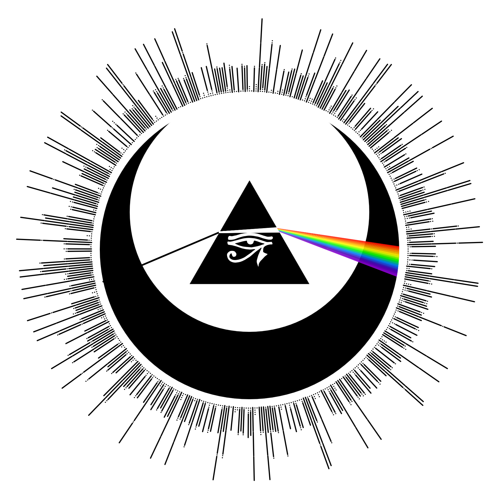

# Tattoo Chest

> **Live:** https://31-rat4.github.io/tattoo-chest/

A live p5.js sketch used as a **reference tool for a chest tattoo**. Every element is a parameter — the browser is the design surface, not a finished illustration.



> If `tattoo.png` is missing or stale, open the sketch in a browser and use the **Save PNG…** button to save a fresh canvas snapshot next to `sketch.js`, then commit it.

## Proposition

Three traditions threaded through one glyph:

- **Franciscan** — the full Portuguese **Prayer of Saint Francis** is Morse-encoded, one letter per radial ray around the sun. The prayer is legible under magnification, not ornamental filler.
- **Pink Floyd / Dark Side of the Moon** — a dispersion prism splits a white laser into a rainbow fan. Refraction is physically simulated (Snell's law, per-wavelength refractive index); the rainbow is the output of math, not art.
- **Wedjat / Eye of Horus (left eye = moon)** — rendered from the actual [Wikimedia Commons SVG path](https://commons.wikimedia.org/wiki/File:Eye_of_Horus.svg), sitting at the prism's centroid.

Tying them together: a sun + offset moon forming an eclipse, with an optional **Mandelbrot set** clipped to the moon disc.

## Running

No build step. Serve the directory with live-reload:

```bash
npx browser-sync start --server --files "*.html, *.js, *.css"
```

All state lives in sliders and checkboxes — tweak live, hit **Save PNG…** to export.

## Project layout

| File | Role |
|---|---|
| [`sketch.js`](sketch.js) | All code (p5 global mode, single file by design) |
| [`index.html`](index.html) | Loads p5 CDN + `sketch.js` |
| [`tattoo.png`](tattoo.png) | Current reference render (regenerated via **Save PNG…**) |
| `.claude/plans/` | In-progress plan files from Claude Code sessions (gitignored) |

## Architecture

One class per visual element; each has a `draw()` method; `CelestialTattoo` composes them in z-order. No external state management — slider values are read directly in the main `draw()` loop and pushed into the elements each frame.

| Class | Role |
|---|---|
| `MorseEncoder` | Converts the prayer text into dot/dash sequences. |
| `Sun` | Sun body circle + Morse corona. Exposes `dashLengthMul`, `strokeWMul`, `symbolGapMul`, `dotAsLine`, `dotLineLenMul` for ray styling. |
| `Moon` | Solid fill + optional Mandelbrot overlay. The fractal is a cached 256×256 `p5.Graphics` buffer with `pixelDensity(1)` (critical — default density would fill only the top-left quadrant on retina displays). `bufferKey = "${contrast}|${zoom}"` invalidates on theme or zoom change. |
| `Prism` | Equilateral triangle; per-wavelength refraction via Snell's law with 40 interpolated samples. External fan drawn as filled quads between adjacent rays (midpoint color) so the gradient has no black gaps. `setSize()` recomputes vertex geometry and the ray math reads those vertices each frame. |
| `EyeOfHorus` | Wedjat from an embedded SVG path (187×140 viewBox). The iris lens is a `beginContour`/`endContour` cutout inside the main figure so the prism's fill shows through as the "whites of the eye." |
| `CelestialTattoo` | Composer. z-order: sun → moon fill → fractal → prism → eye. |

## Theme + inversion system

Two globals drive color: `THEME = { bg, fg }` and `INVERT_BODIES`. **All drawing code reads from these** — literal `0` / `255` in draw code is a bug. Inversion flips which element gets `bg` vs `fg` (eclipse look): sun body becomes filled, moon fills `bg`, prism flips fill and stroke so it stays readable against either backdrop, and the incoming laser flips to still "cut" through a filled region.

## Controls (all live, all synced)

- **Top toggles**: Dark mode · Invert sun/moon · Hide sun outline · Fractal · Eye of Horus
- **Prism**: Tilt (deg) · Aim fraction · Base n · Dispersion spread · Size
- **Moon**: Scale · Angle (deg, 0–360) · Offset (radial, ±300)
- **Fractal**: Zoom (regenerates Mandelbrot buffer — brief lag during drag is expected)
- **Morse Ray**: Dash length · Stroke weight · Symbol gap · Dot-as-line · Dot length

Every slider has a paired `<input type="number">`; they two-way sync via `slider.input()` / `input.input()` so typing a value works identically to dragging.

Click **Save PNG…** in the top-right panel to export the current canvas (uses the browser's File System Access API when available so you choose the save location, otherwise falls back to a download).

## Conventions for agents editing this repo

- Keep the single-file structure. `sketch.js` is deliberately one file; don't split into modules unless the user asks.
- When adding a new visual element: new class with `draw()`, instantiate in `CelestialTattoo`, add to the correct z-order slot, expose parameters as sliders in `createControls` under the right section.
- When adding a new parameter: add it as a property on the class (not a global), wire a slider + input via `makeControl`, read the slider in the main `draw()` loop and push into the element. This is the pattern every existing parameter follows.
- Colors always flow through `THEME` / `INVERT_BODIES`. If an element needs a new color decision, follow the existing `INVERT_BODIES ? THEME.x : THEME.y` idiom so the invert toggle keeps working.
- The Mandelbrot buffer is expensive to regenerate. Any change that affects its output must update `bufferKey`.
